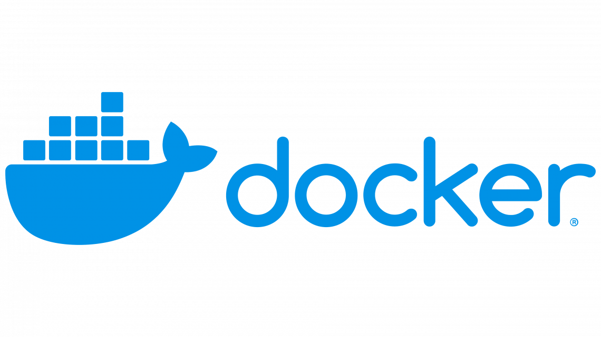

<p align = "center">
    

---

## Tabla de contenido:
    
1. [Integrantes y roles asignados](https://github.com/optimizacion-2-2022-gh-classroom/practica-2-primera-parte-urieluard#integrantes-y-roles-asignados)
    
2. [Acerca de este proyecto](https://github.com/optimizacion-2-2022-gh-classroom/practica-2-primera-parte-urieluard#acerca-de-este-proyecto)
    
3. [Estructura básica del repositorio](https://github.com/optimizacion-2-2022-gh-classroom/practica-2-primera-parte-urieluard#estructura-b%C3%A1sica-del-repositorio)
    
4. [¿Qué lenguajes y paqueterías utlizamos?](https://github.com/optimizacion-2-2022-gh-classroom/practica-2-primera-parte-urieluard#qu%C3%A9-lenguajes-y-paqueter%C3%ADas-utlizamos)

5. [Ambientes en Contenedor](https://github.com/optimizacion-2-2022-gh-classroom/practica-2-primera-parte-urieluard#ambientes-en-contenedor)

6. [Resultados obtenidos](https://github.com/optimizacion-2-2022-gh-classroom/practica-2-primera-parte-urieluard#resultados-obtenidos)
    
7. [Referencias](https://github.com/optimizacion-2-2022-gh-classroom/practica-2-primera-parte-urieluard#referencias)
    
---

## Integrantes y roles asignados

|     ***Integrante***      |             ***Usuario de GitHub***             |  ***Rol asignado***        |                       
|:-------------------------:|:-----------------------------------------------:|:--------------------------:|
|  Ita                      |    [sancas96](https://github.com/sancas96)      | Equipo de Programación     | 
|  Luz                      |    [LuzVerde23](https://github.com/LuzVerde23)  | Administrador de proyecto  | 
|  Edgar                    |    [EddOselotl](https://github.com/EddOselotl)  | Equipo de Programación     | 
|  Uriel                    |    [urieluard](https://github.com/urieluard)    | Equipo de Programación     | 

---    

## Acerca de este proyecto
    
Esta práctica se enfoca en el uso de Minikube, Kubeflow y Kale para construcción y lanzamiento de pipelines de procesamiento y experimentación del paquete construído en el [ejercicio 1](https://github.com/optimizacion-2-2022-gh-classroom/practica-1-segunda-parte-LuzVerde23) para resolver el problema de flujo máximo con el algoritmo de Ford-Fulkerson.

El objetivo es realizar experimentos con las herramientas de Minikube, kubeflow y Kale para detectar con qué valores no funcionan el programa implementado en el ejercicio 1. Para elllo se cambian algunos parámetros del programa y se hacen pruebas con diferentes redes.
 
## Estructura básica del repositorio

```
practica-2-primera-parte-urieluard:
 |
 ├── README.md                                   <- Contiene información relevante del proyecto.
 │
 ├── reporte_equipo_2_parte_1_practica_2.ipynb   <- Note Book con el reporte donde se muestran los resultados de las pruebas realizadas al algoritmo.
 |
 ├── BD                                          <- Bases de datos utilizadas para comprobar el método
 │
 ├── Dockerfiles                                 <- Carpeta con archivo de Docker que crea la imágen del entorno para la ejecución del método
 |
 ├── src                                         <- Archivos y estructura de carpetas necesarias para el paquete
 │
 └── images                                      <- Contiene las imágenes utilizadas en el repositorio.
``` 

## ¿Qué lenguajes y paqueterías utlizamos?


[Minikube](https://minikube.sigs.k8s.io/docs/start/)


[kubeflow](https://www.kubeflow.org/)


[kubeflow-kale](https://github.com/kubeflow-kale/kale)

---

## Ambientes en Contenedor

### Binder

En el siguiente botón se realiza el lanzamiento de un ambiente ejeutable donde se podrá interactuar con el paquete realizado (**MaxFlowAeiu**)
    
[](https://mybinder.org/v2/gh/optimizacion-2-2022-gh-classroom/practica-1-segunda-parte-LuzVerde23/main?labpath=reporte_equipo_2_parte_2_practica_1.ipynb)

### Docker

De igual forma, en este repositorio se cuenta con un archivo de Docker para crear el contenedor que contiene todas las librerías y el paquete creado para que pueda ser utilizado desde [Docker](https://www.docker.com/).

<p align = "center">
    

---

## Resultados obtenidos


---

## Referencias